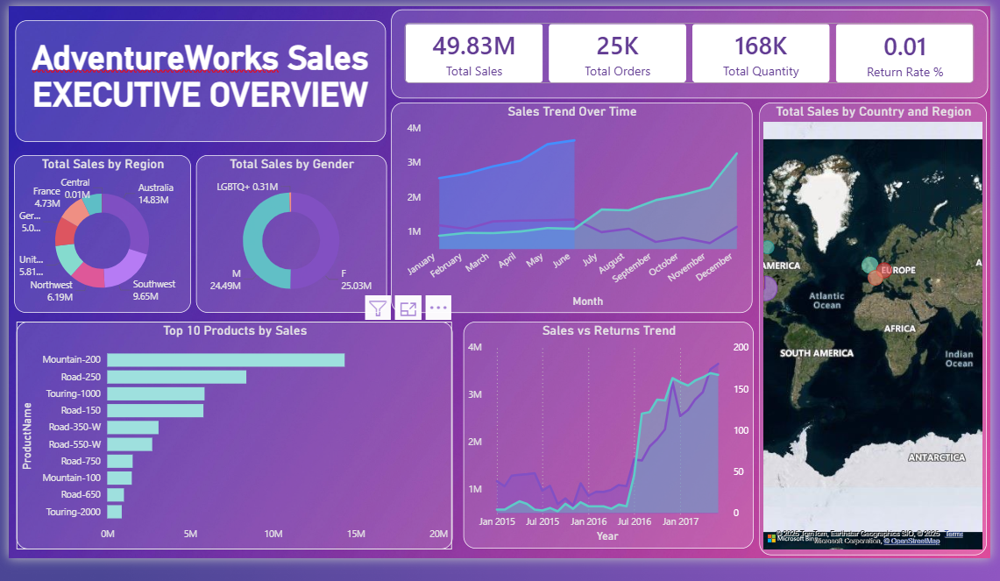

# Azure Retail Sales & Customer Analytics – AdventureWorks

An **end-to-end Azure Data Engineering & Analytics project** implementing a **Medallion Architecture (Bronze–Silver–Gold)** using real Azure services and a business-ready **Power BI Executive Dashboard**.

This project demonstrates how raw retail data can be dynamically ingested, transformed, modeled, and visualized using **Azure Data Factory, Azure Data Lake Gen2, Azure Databricks, Azure Synapse Analytics (Serverless SQL), and Power BI**.

---

## 🚀 Project Architecture Overview

**High-level Data Flow**

GitHub (Retail CSV Files)  
→ Azure Data Factory (Dynamic Ingestion)  
→ ADLS Gen2 **Bronze Layer**  
→ Azure Databricks (Transformations)  
→ ADLS Gen2 **Silver Layer**  
→ Azure Synapse Analytics (External Tables & Gold Views)  
→ Power BI Dashboard


---

## 🟤 Bronze Layer – Raw Data Ingestion

**ADF Assets Location (Repo):**
```
datafactory/
  ├── pipelines/
  └── parameters/
      └── git.json
```


**Technology:** Azure Data Factory + Azure Data Lake Storage Gen2

### What happens in Bronze?
- Source retail data is hosted in GitHub
- Azure Data Factory uses **dynamic pipelines** to ingest data
- A **Lookup activity** reads metadata from a parameter file (`git.json`)
- A **ForEach activity** iterates through file definitions
- Copy activity loads raw data into ADLS Bronze

### Key Features
- Fully parameterized ingestion
- Scalable and reusable pipeline design
- No schema enforcement
- Raw data preserved for auditing and reprocessing

### Bronze Storage Structure
```
/bronze/
  ├── calendar
  ├── customers
  ├── products
  ├── sales
  └── returns
```

---

## ⚙️ Parameterization – `git.json`

**Location:** ADLS Gen2 → `parameter/git.json`

This file drives the **dynamic ingestion** logic in Azure Data Factory.

### Purpose
- Stores source metadata such as file names and paths
- Eliminates hardcoded pipelines
- Enables easy onboarding of new datasets

### Example Responsibilities
- Controls which GitHub files are ingested
- Passed into Lookup activity
- Used inside ForEach loop

This design closely follows **enterprise-grade ingestion patterns**.

---

## ⚪ Silver Layer – Data Transformation

**Technology:** Azure Databricks (PySpark)

### What happens in Silver?
- Raw Bronze data is read from ADLS
- Data cleaning and transformation is performed
- Null handling and data type casting
- Column standardization and renaming
- Data written back in **Parquet format**

### Purpose
- Produce clean, analytics-ready datasets
- Optimize performance for downstream queries

### Silver Storage Structure
```
/silver/
  ├── AdventureWorks_Calendar
  ├── AdventureWorks_Customer
  ├── AdventureWorks_Product
  ├── AdventureWorks_Sales
  ├── AdventureWorks_Return
  ├── AdventureWorks_SubCategory
  └── AdventureWorks_Territory
```

---

## 🟡 Gold Layer – Business & Analytics Layer

**Technology:** Azure Synapse Analytics (Serverless SQL)

> ⚠️ In this project, the **Gold layer is created directly in Synapse**, not in Databricks.

### Gold Layer Implementation
- Created **database scoped credentials** using Managed Identity
- Defined **external data sources** pointing to Silver and Gold containers
- Created **external tables** over Silver Parquet data
- Built **Gold views** using joins and business logic

### Purpose
- Logical business layer
- Star-schema style modeling
- Optimized for BI and analytics consumption

### Gold Objects (Views)
```
extsales
extcustomers
extproducts
extreturns
extcalendar
extsubcat
extterritories
```

---

## 📊 Power BI – Analytics & Visualization

**Technology:** Power BI Desktop

### Executive Dashboard

The project includes a **single-page Executive Overview Dashboard** designed for leadership-level decision making.

📸 **Dashboard Screenshot:**




### What was built?
- Connected to Azure Synapse Serverless SQL
- Imported Gold Views
- Created a star-schema data model
- Developed reusable **DAX measures**
- Designed a **single-page executive dashboard**


**Technology:** Power BI Desktop


### Key KPIs
- Total Sales
- Total Orders
- Total Quantity
- Return Rate %
- Sales Year-over-Year %
- Sales per Customer

---

## 🛠️ Technologies Used

- Azure Data Factory
- Azure Data Lake Storage Gen2
- Azure Databricks
- Azure Synapse Analytics (Serverless SQL)
- Power BI
- PySpark
- SQL
- DAX

---

## 📁 Repository Structure

```
Azure-Retail-Sales-Customer-Analytics-AdventureWorks
│
├── README.md
├── azure_medallion_architecture.png
│
├── datafactory/
│   ├── pipelines/
│   │   └── DynamicGitToRaw.png
│   └── parameters/
│       └── git.json
│
├── databricks/
│   └── silver_layer_transformation.ipynb
│
├── synapse/
│   ├── Create_Schema.sql
│   ├── Create_External_Table.sql
│   └── Create_View_Gold.sql
│
├── powerbi/
│   ├── AdventureWorks_Executive_Dashboard.pbix
│   ├── measures_dax.txt
│   └── screenshots/
│       └── executive_dashboard.png
```


---

- Implemented real-world Azure Medallion Architecture
- Built dynamic and parameterized ADF pipelines
- Performed scalable Spark transformations
- Used Synapse Serverless SQL for analytics without data movement
- Designed an executive-level Power BI dashboard

---

## 👤 Author

**B M Bharath**  


